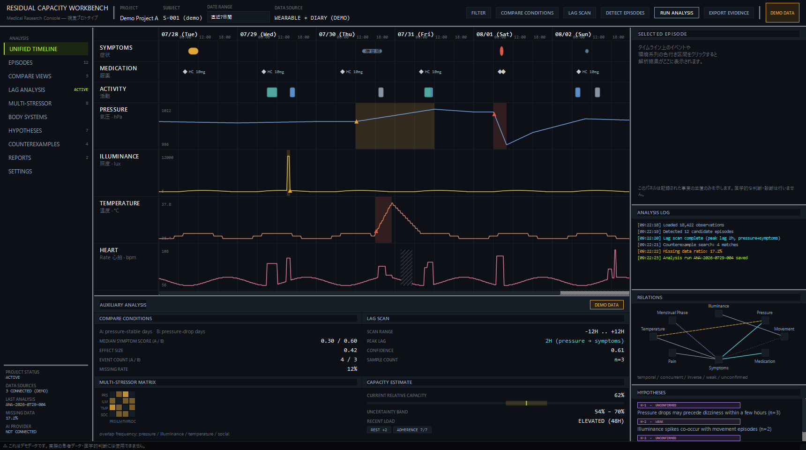
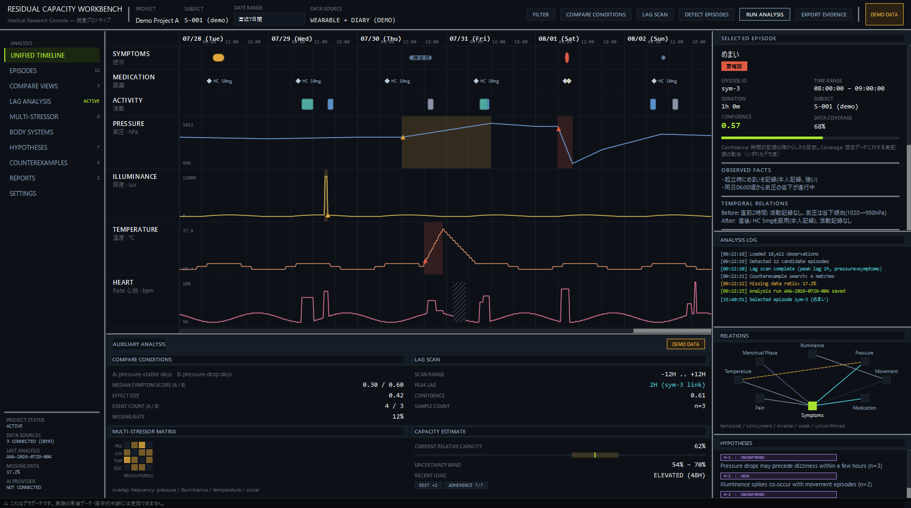
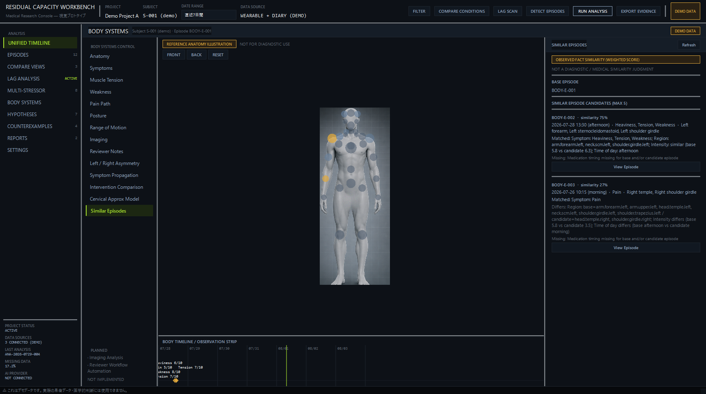
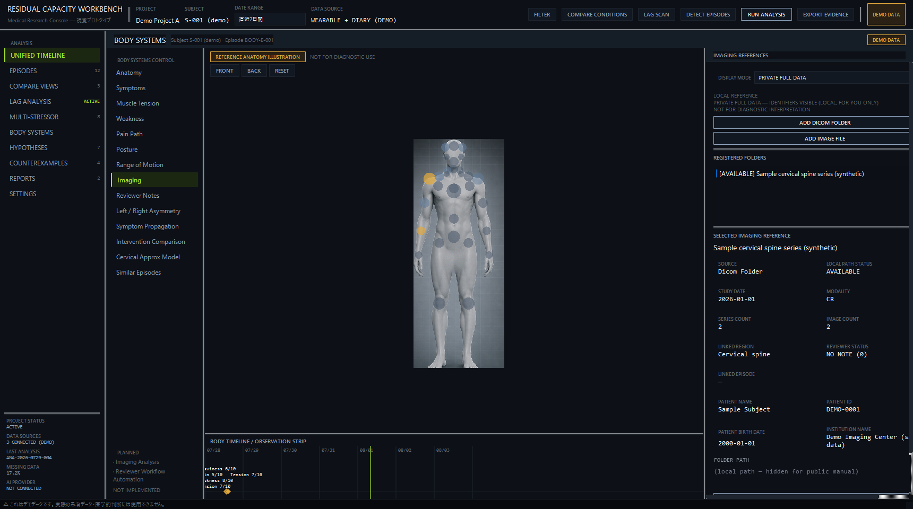
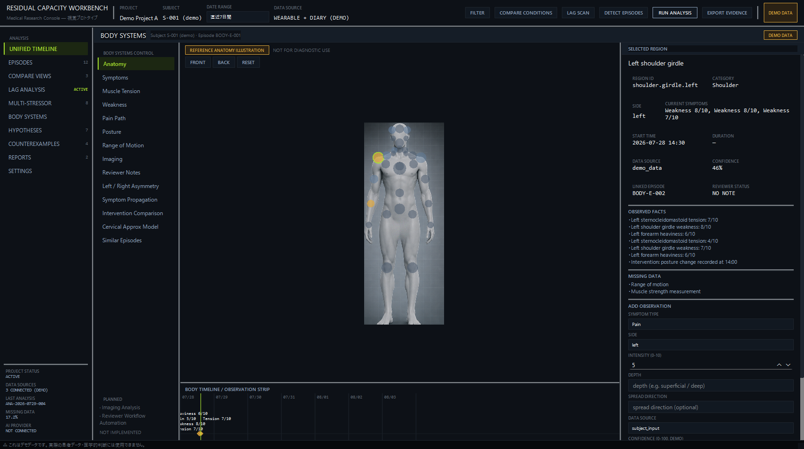
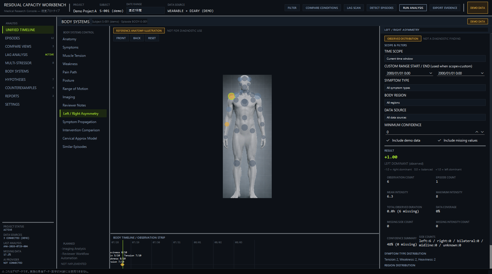
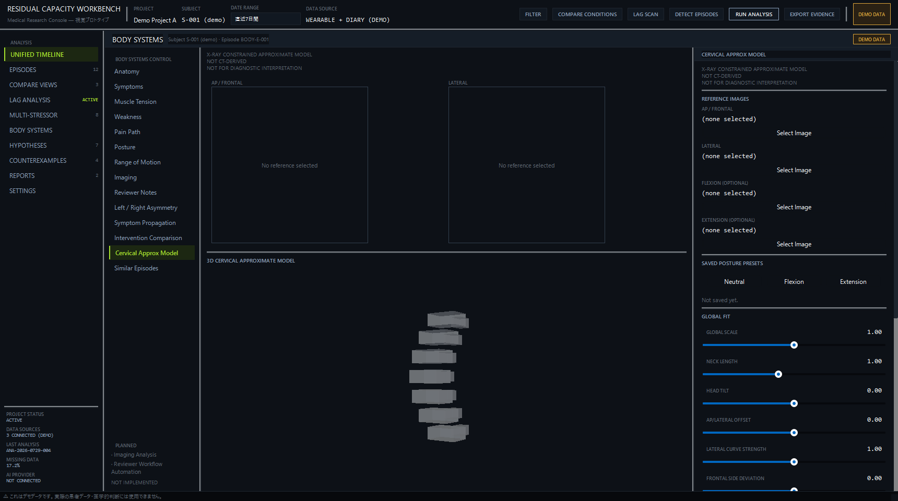

# Residual Capacity Workbench — 公開マニュアル（2026-08-03時点）

## 1. タイトル

**Residual Capacity Workbench — 視覚プロトタイプ 公開マニュアル**

本書は、現時点（2026-08-03）で実装済みの画面・機能のみを対象とした説明資料です。

---

## 2. 概要

Residual Capacity Workbench（RCW）は、個人の観測データ（症状・服薬・活動の記録、
気圧・照度・温度・心拍などの環境/生体系列、身体部位ごとの所見など）を時系列・部位別に
並べて俯瞰するための、デスクトップ向けの**視覚・操作感プロトタイプ**です。**研究用
ワークベンチ**（個人観測データの整理・比較・仮説検討のための試作環境）として位置づけて
います。

画面は「Unified Timeline」（統合タイムライン）と「Body Systems」（身体部位別ビュー）の
2つの独立したワークスペースで構成されています。

現時点では本格的な統計解析・AI連携・実データの一括取り込みは行っておらず、画面上の一部は
組み込みのデモ（架空）データで構成されています。どの部分が実データで計算されており、
どの部分がデモ表示のみかは、本書「8. 現在できること」「9. 現在できないこと／未実装点」に
区別して記載しています。

---

## 3. このアプリの目的

観測された事実（記録された時刻・値）を時系列・身体部位別に**並置して比較する**ことを
目的としています。相関関係の時間的な近接は表示しますが、因果関係の推定や医学的な原因の
特定は行いません。未実装の機能を実装済みのように見せる偽の数値・グラフも表示しません。

**本アプリは医療機器・診断支援ソフトウェア・治療支援ソフトウェアではありません。**
医学的な判断・診断は行わず、実際の医学的判断は医療専門職が行う必要があります。

---

## 4. 想定利用者

- 自分自身の観測データ（症状・服薬・活動・環境系列・身体部位ごとの所見など）を、
  時系列・部位別に整理・比較したい個人
- 複数の要因の時間的な近接関係を（因果と断定せずに）確認したいレビュアー・研究協力者

現時点では、複数患者を扱う臨床運用や、医療機関でのカルテ的利用は想定していません。

---

## 5. 入力データ

RCWは画面（ワークスペース）によって、入力できるデータの性質が異なります。

### Unified Timeline

現時点では**組み込みのデモデータのみ**を表示する画面です。症状・服薬・活動・メモの
イベントと、気圧・照度・温度・心拍の時系列は、いずれもアプリ内にあらかじめ用意された
架空のサンプルデータであり、ユーザーが新規のイベントや系列データを入力する機能は
現時点ではありません。

### Body Systems

以下のデータをユーザーが実際に入力・保存できます（ローカルのSQLiteファイルに永続化されます）。

- 身体部位ごとの観測記録（部位・症状の種類・強度・左右・深さ・広がり方向・確信度・
  データの由来・メモ）
- 姿勢の所見記録（Posture）
- 可動域の記録（Range of Motion）
- 介入記録（Intervention）と、介入前後の比較のための時間窓設定
- 症状の出現順序の記録（Symptom Propagation）
- レビュアーによる所見メモ（Reviewer Notes）
- DICOMフォルダ・画像ファイルへの参照登録（Imaging References。詳細は
  「7.4 Imaging Analysis（画像参照ビューア）」を参照）
- 頸椎近似モデルのフィッティングパラメータ（Cervical Approx Model）

---

## 6. 主要機能

- **Unified Timeline** — 症状/服薬/活動/メモの記録と、気圧/照度/温度/心拍の時系列を
  共通の時間軸上に統合表示
- **Body Systems: 3D身体図 + 症状オーバーレイ** — 簡易人体モデル上で部位を選択し、
  記録済みの症状を確認・新規記録を追加
- **Body Systems: Left / Right Asymmetry** — 保存済み観測データから左右差を計算
- **Body Systems: Symptom Propagation** — 症状の出現順序の記録と、伝播候補の自動提示
- **Body Systems: Intervention Comparison** — 介入前後の観測データを比較
- **Body Systems: Similar Episodes** — 保存済みエピソード同士の類似度を観測事実に基づき計算
- **Body Systems: Imaging References** — DICOMフォルダ/画像ファイルへの参照登録・
  一覧・拡大表示（読み取り専用）
- **Body Systems: Cervical Approx Model** — レントゲン画像を参照した頸椎近似3Dモデルの
  手動フィッティング
- **Body Systems: Posture / Range of Motion** — 姿勢・可動域の記録と保存
  （本書では画面キャプチャは掲載していません）
- **Body Systems: Reviewer Notes** — レビュアーによる所見メモの下書き保存

---

## 7. 画面ごとの説明

### 7.1 メイン画面（Unified Timeline）

症状・服薬・活動・メモの4つのイベントレーンと、気圧・照度・温度・心拍の4つの時系列
レーンを、共通の時間軸上に表示します。右側には選択中エピソードの詳細、解析ログ、
関係グラフ、仮説一覧が表示されます。

表示内容は組み込みのデモデータです。上部の各操作ボタン（Filter / Compare Conditions /
Lag Scan / Detect Episodes / Run Analysis / Export Evidence）は、現時点ではいずれも
表示・ログ出力のみで、実際の絞り込み・計算処理は行いません。

### 7.2 体調ログ（タイムラインのイベント選択表示）

タイムライン上のイベント（症状・服薬・活動など）を選択すると、右側の
SELECTED EPISODEパネルに、そのイベントの観測事実・時間的な前後関係・関連する要因の
時間的近接・反例（counterexample）・欠測データなどが表示されます。

現時点では、Unified Timeline側に症状や服薬記録を新規入力するための専用フォームは
なく、表示専用のデモイベント一覧です。

### 7.3 Similar Episodes

**現在の実装範囲**: 実装済み（試作段階）。Body Systemsワークスペース内の機能です。
選択中の基準エピソードと、保存済みの他のエピソードとの類似度を、症状の種類・身体部位・
平均強度差・時間帯の一致・服薬タイミング差という5つの観測項目を重み付けして計算し、
候補を一覧表示します。機械学習やAIによる推定ではなく、記録された値同士の単純な比較
です。値が欠測している項目はスコアから除外され、残りの項目で再計算されます。

画面上に明記されている通り「NOT A DIAGNOSTIC / MEDICAL SIMILARITY JUDGMENT」であり、
医学的な類似性の判断ではありません。

**今後の拡張候補**: 未定。

### 7.4 Imaging Analysis（画像参照ビューア / Imaging References）

> **名称についての注記**: このスクリーンショットのファイル名は「Imaging Analysis」
> ですが、実際に実装されている機能はDICOMフォルダ・画像ファイルの**参照登録・一覧・
> 拡大表示**（Imaging References / DICOM Image Gallery）です。画像から所見や診断を
> 推定する「画像診断支援」としてのImaging Analysis機能は、現時点では**未実装
> （PLANNED）**です（左下のPLANNED欄にも明示されています）。両者は名称が似ていますが
> 別機能である点にご注意ください。

**現在の実装範囲**: 実装済み（試作段階）。登録済みフォルダ・画像ファイルのメタデータ
（種類・検査日・シリーズ数・画像数など）を読み取り専用で一覧・表示します。フォルダ・
ファイルの中身は移動・編集・削除しません。

識別情報（患者名・患者ID・生年月日・医療機関名）の表示モードとして、PRIVATE FULL DATA
（既定。本人向けにすべて表示）とANONYMIZED VIEW（識別情報のみ画面上でREDACTED表示）を
切り替えられます。匿名化は表示上のマスクのみで、保存データ自体は変更されません。
外部送信・共有用の出力機能自体は未実装です。画面上には常に
「NOT FOR DIAGNOSTIC INTERPRETATION」が明示されます。

本スクリーンショットに写っている患者名・患者ID・生年月日・医療機関名・画像は、本
マニュアル作成のために生成した完全な架空のサンプルデータであり、実在の人物・医療機関の
情報は含まれません。

**今後の拡張候補**: 外部共有・レポート出力・AI API送信等の実処理は未定
（表示モードの土台のみ実装済み）。

### 7.5 身体図（3D Anatomy View）

**現在の実装範囲**: 実装済み（試作段階）。簡易セグメント人体モデル（3D）上で身体部位を
クリック選択し、記録済みの症状オーバーレイ（色・パターンで強度を表現）を確認します。
選択した部位の観測記録一覧と、新規観測を追加するフォームが右側に表示されます
（ローカルのSQLiteファイルに保存されます）。

画面上に「DEMO ANATOMY MODEL」「NOT FOR DIAGNOSTIC USE」が常設表示されます。実際の
解剖学的モデルではなく、簡易的なセグメントモデルです。「身体図（Body Map）」は本書内での
呼称であり、精密な医用画像や実測に基づく身体地図ではありません。

### 7.6 左右差解析（Left / Right Asymmetry）

**現在の実装範囲**: 実装済み（試作段階）。保存済みの観測データから、左右どちらの記録が
優勢かを示す指標（-1.0〜+1.0）、観測件数、平均強度、データカバレッジなどを、その都度
計算して表示します。期間・症状の種類・部位・データの由来・最小確信度でのフィルタが
可能です。

画面上に「NOT A DIAGNOSTIC FINDING」が明示されます。記録の分布を示す集計であり、
医学的判断ではありません。

### 7.7 Cervical Approx Model

**現在の実装範囲**: 実装済み（試作段階）。標準的な7椎体の頸椎ブロックモデルを、
AP（正面）/ Lateral（側面）のレントゲン画像を参照しながらスライダーで手動フィッティング
する研究用プロトタイプです。Neutral / Flexion / Extensionの3つの姿勢プリセットを
それぞれ保存し、比較できます。

画面上に「X-RAY CONSTRAINED APPROXIMATE MODEL」「NOT CT-DERIVED」
「NOT FOR DIAGNOSTIC INTERPRETATION」が常設表示されます。CT画像由来のモデルではなく、
AIによる自動推定・形状最適化も行いません。

**今後の拡張候補**: 未定（AI自動再構成・形状最適化・AP/Lateral投影オーバーレイは
現時点で計画のみで実装時期は未確定）。

---

## 8. 現在できること

- Unified Timelineで、症状/服薬/活動/メモとバイタル・環境系列を共通の時間軸上に
  俯瞰する（組み込みのデモデータ）
- Body Systemsで、身体部位ごとの観測記録・姿勢記録・可動域記録・介入記録・症状の
  出現順序記録・レビュアーメモを入力し、ローカルのSQLiteファイルに保存する
- 保存済みの記録から、Left/Right Asymmetry・Symptom Propagation・Intervention
  Comparison・Similar Episodesを、その都度計算して表示する
- DICOMフォルダ・画像ファイルを参照登録し、メタデータの一覧表示・画像の拡大表示を行う
  （読み取り専用、フォルダ・ファイルの中身は変更しない）
- 識別情報の表示をPRIVATE FULL DATA / ANONYMIZED VIEWで切り替える（表示層のみのマスク）
- レントゲン画像を参照した頸椎近似3Dモデルの手動フィッティングと、姿勢プリセットの保存

---

## 9. 現在できないこと／未実装点

- Unified Timelineへの実データ入力・CSVインポート（現状は組み込みデモデータの表示のみ）
- Unified Timeline上部の各操作ボタン（Filter / Compare Conditions / Lag Scan /
  Detect Episodes / Run Analysis / Export Evidence）の実処理（現状は表示・ログ出力のみ）
- AI・外部APIとの連携（アプリ内に常時「AI PROVIDER: NOT CONNECTED」と表示される通り、
  外部AI API・ローカルLLM等への接続は一切実装していません）
- 画像から所見・診断を推定する「Imaging Analysis」（画像診断支援）機能
  （現時点ではPLANNED。実装済みの「Imaging References」とは別の未実装機能です）
- Reviewer Workflow Automation（レビュアー運用フロー全体の自動化。現状は単発の
  下書き保存のみ）
- 外部共有・X投稿用画像生成・レポート出力・AI APIへのデータ送信の実処理
  （ANONYMIZED VIEWは表示モードの土台のみ）
- Unified TimelineとBody Systems間の完全な双方向同期（現状は選択中の時刻情報のみを
  共有）
- Unified Timeline側の既存イベント（服薬・活動・メモ）をInterventionへ自動的に
  参照・変換する仕組み
- Symptom Propagationにおける、異なる症状種別をまたいだ「症状群としての伝播」の自動検出
  （現状は同一症状種別の組み合わせのみ）
- Counterexampleの自動連携（現状は手動記述のみ）
- Cervical Approx ModelのAI自動再構成・形状最適化、AP/Lateral投影オーバーレイ
- 本格的な統計解析（Unified Timelineの補助解析パネルの数値は組み込みのデモ集計値）

---

## 10. 研究用ワークベンチとしての位置づけ

RCWは「記録アプリ」ではなく、**個人観測データの整理・比較・仮説検討のための試作環境**
（研究用ワークベンチ）として設計されています。すべての画面に共通する原則は次の通りです。

- 記録された時刻・値の**並置**のみを行い、因果関係の推定や医学的な原因の特定は行わない
- 時間的な近接を示す情報には、常に「因果関係を示すものではない」旨の注記を添える
- 一方向の説明だけでなく、それに反する記録（反例・counterexample）も併記する
- confidence（確信度）・coverage（データカバレッジ）は、記録の確からしさ・網羅性の
  目安であり、診断確信度や統計的有意性を意味しない
- 未実装の機能は、実装済みであるかのような偽の数値・グラフを表示せず、
  PLANNED / NOT IMPLEMENTEDと明示する
- Symptom Propagation・Intervention Comparisonなどの解析機能も、「観測された順序」
  「時間的な前後比較」であることを画面上に明示し、因果を主張しない

---

## 11. データとプライバシー上の注意

- RCWはローカル（利用者自身のPC）で動作し、データはローカルのSQLiteファイル
  （`body_systems.sqlite3`）に保存されます。外部サーバー・クラウドへの自動送信は
  行いません。
- 現状、AI API等の外部サービスとの接続は一切ありません
  （アプリ内に常時「AI PROVIDER: NOT CONNECTED」と表示）。
- Imaging Referencesで登録するのはDICOMフォルダ・画像ファイルへの「参照（パス・
  メタデータ）」のみであり、元データ自体を移動・編集・削除することはありません。
- 患者名・患者ID・生年月日・医療機関名などの識別情報は、既定でPRIVATE FULL DATA
  （本人向けの全表示）です。外部共有等を想定したANONYMIZED VIEW（識別情報のみを
  画面上でREDACTED表示）に切り替えられますが、これは表示上のマスクであり、保存データ
  自体は変更されません。外部送信・エクスポート機能自体は現時点で未実装です。
- 本書に掲載したスクリーンショット内の患者名・患者ID・生年月日・医療機関名・画像・
  ファイルパスは、本マニュアル作成のために生成した架空のサンプルデータ、または
  公開前に匿名化処理を行ったものであり、実在の人物・医療機関・実際のファイルシステム
  構成の情報は含まれません。
- RCWが表示する内容はいずれも観測データの整理・並置であり、医学的な解釈・診断を
  行うものではありません。実際の医学的判断は、医療専門職が行う必要があります。

---

## 12. 開発状況

- 現在も開発中の視覚・操作感プロトタイプです。
- Unified Timeline、Body Systems（3D身体図・観測記録・Left/Right Asymmetry・
  Symptom Propagation・Intervention Comparison・Similar Episodes・Imaging
  References・DICOM Image Gallery・Cervical Approx Model・Posture・Range of
  Motion・Reviewer Notes）が、本書執筆時点（2026-08-03）で実装され、動作を確認して
  います。
- 自動テストスイート（pytest）が整備されており、本書執筆時点で268件のテストが
  すべて成功することを確認しています。
- 進捗率（％）は数値として算出・公表していません。

---

## 13. Webサイト

SystemLink YandY（本アプリの開発元サイト）: https://systemlinkyandy-hub.github.io/systemlink-yandy-site/

本ページ（Residual Capacity Workbench 公開説明ページ）: https://systemlinkyandy-hub.github.io/systemlink-yandy-site/residual-capacity-workbench.html

---

## 14. GitHub

本マニュアルおよび公開ページのリポジトリ: https://github.com/systemlinkyandy-hub/systemlink-yandy-site

Residual Capacity Workbench本体（解析用デスクトップアプリ）のソースコードは、本リポジトリには含まれません。公開の可否は別途判断します。

---

## 15. 連絡先

systemlink.yandy@gmail.com

内容を確認のうえ、可能な範囲で返信します。診断、治療、服薬量に関する個別の医療相談には対応していません。
